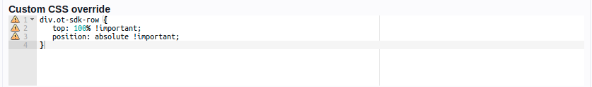
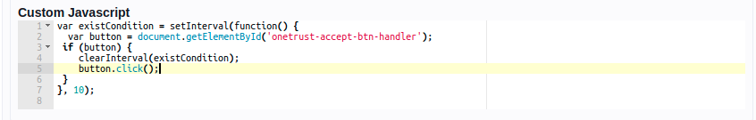

# Web Kiosk

Bring online experience into the physical space.

#### Setting up

To set up a new Web Kiosk installation, check out the [Setting up a Web Kiosk](/apps/web-kiosk/setting-up) guide.

#### Content

To configure the contents of your Web Kiosk, check the [adding content](/apps/signage/adding-content.md) guide.

- Adding custom css override

  a. Identify target element class and override the styles

  Example:
  

- Adding custom js

  a. Identify target's element id or class and use custom js

  Example:
  

#### Device Support and Configuration

Currently, only devices running on GridOS can be used for Web Kiosk. Check the [adding content](/apps/signage/adding-content.md) guide for more details.
