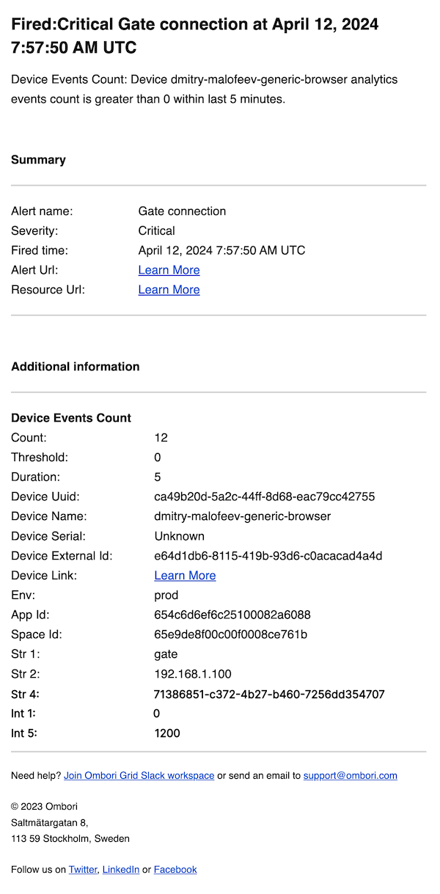
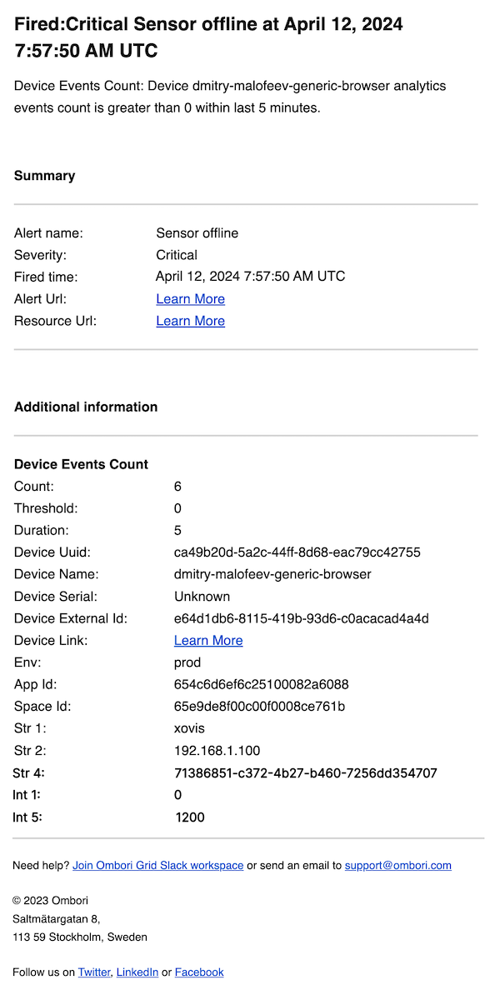

# Alerts System

The alerts system is a way to notify users of important information or issues.

## Table of Contents

- [General overview](#general-overview)
- [Notification groups](#notification-groups)
- [Alert rules](#alert-rules)
  - [General settings](#general-settings)
    - [Severity](#severity)
    - [Scope](#scope)
  - [Conditions](#conditions)
    - [Device status](#device-status-condition)
      - [Email notification payload](#device-status-condition-email-notification-payload)
      - [Webhook notification payload](#device-status-condition-webhook-notification-payload)
    - [Device daily analytics session count](#device-daily-analytics-session-count-condition)
      - [Email notification payload](#device-daily-analytics-session-count-condition-email-notification-payload)
      - [Webhook notification payload](#device-daily-analytics-session-count-condition-webhook-notification-payload)
    - [Device analytics events count](#device-analytics-events-count)
      - [Email notification payload](#device-analytics-events-count-email-notification-payload)
      - [Webhook notification payload](#device-analytics-events-count-webhook-notification-payload)
  - [Actions](#actions)
- [Examples](#examples)
  - [Device status alert](#device-status-alert-example)
  - [Device daily analytics session count alert](#device-daily-analytics-session-count-alert-example)
  - [Device analytics events count alert](#device-analytics-events-count-alert-example)
  - [POS data alert](#pos-data-alert-example)
  - [People tracking alert](#people-tracking-alert-example)
  - [Gate connection alert](#gate-connection-alert-example)
  - [Sensor offline alert](#sensor-offline-alert-example)

## General overview

The alerts system is a way to notify users of important information or issues. Alerts can be triggered by several conditions, such as device status or analytics data.

To see the alerts UI in the console, go to the "Menu" tab in the left sidebar and select "Alerts" link.


On the screenshot above you can see the alerts UI in the console. There are two tabs: "Alert rules" and "Notification groups". The "Alert rules" tab shows the list of alerts that have been created. The "Notification groups" tab shows the list of notification groups that are used by alert rules.

Let's take a closer look at each of these tabs and their functionality.

We start with the "Notification groups" tab.

## Notification groups

Notification groups are used to group users who will receive alerts. You can create multiple notification groups and assign them to alert rules.


To create a new notification group, click the "Create notification group" button. You will see a form where you can enter the notification group settings.


In the form, you can set the notification group name, description and specify email recipients or webhook URL if you would like to receive alert notifications via http requests. 

After you have created a notification group, you can assign it to an alert rule.

## Alert rules

Alert rules are used to define the conditions that trigger an alert and the actions that should be taken when the alert is triggered.


To create a new alert rule, click the "Create rule" button. You will see a form where you can enter the alert rule settings.

### General settings

In the general settings section, you can set the alert rule name, description, severity and scope.


#### Severity

The severity of the alert rule can be set to 
- Critical
- Error
- Warning
- Information

The severity determines how often the alert notification will be sent.

Please refer the following table for the severity levels and their corresponding notification frequency:

| Severity   | Notification frequency |
|------------|------------------------|
| Critical   | Every 15 minutes       |
| Error      | Every 30 minutes       |
| Warning    | Every 60 minutes       |
| Information| Every 120 hour         |

#### Scope

Scope determines the devices that the alert rule applies to.

For example, if it is a global scope then the alert rule will be applied to all devices within the tenant, or if it is an installation scope then the alert rule will by applied only to installation-related devices.

### Conditions

In the conditions section, you can define the conditions that trigger the alert. It is possible to define multiple conditions for the alert rule. If multiple conditions are defined, then an alert notification will be sent for each met condition.


To create a new condition, click the "Add condition" button. You will see a form where you can select the condition type and set the condition settings.

#### Device status condition

> Attention! This is a device related condition. The device needs to have the "Is Monitored" flag turned on for this condition to work. You can change this setting on the device settings page.

This condition triggers an alert when the device status changes.


You can specify the timeframe within which the system should analyze any changes in the device status for this particular condition. If the device status was changed within the specified time, then the alert will be triggered.

Currently, it is possible to define the following duration values:
- 5 minutes
- 10 minutes
- 15 minutes
- 20 minutes
- 25 minutes
- 30 minutes

##### Device status condition email notification payload


##### Device status condition webhook notification payload

```json
{
  "title": "Fired:Critical Device status at April 11, 2024 9:24:39 AM UTC",
  "description": "Device Status: Device dmitry-malofeev-generic-browser is back online.",
  "alertRuleId": "6617aaa9df2e420008b1ec49",
  "alertRuleName": "Device status",
  "severityName": "Critical",
  "severityValue": 0,
  "firedAt": "April 11, 2024 9:24:39 AM UTC",
  "alertRuleUrl": "https://console.omborigrid.com/organisations/5cbac8a388e174147b878cdd/alerts/alert-rules/update/6617aaa9df2e420008b1ec49#general",
  "additionalInfo": [
    {
      "deviceUuid": "ca49b20d-5a2c-44ff-8d68-eac79cc42755",
      "deviceName": "dmitry-malofeev-generic-browser",
      "deviceSerial": "Unknown",
      "deviceExternalId": "e64d1db6-8115-419b-93d6-c0acacad4a4d",
      "deviceLink": "https://console.omborigrid.com/organisations/5cbac8a388e174147b878cdd/devices/v3/ca49b20d-5a2c-44ff-8d68-eac79cc42755/screen/",
      "env": "prod",
      "appId": "654c6d6ef6c25100082a6088",
      "spaceId": "65e9de8f00c00f0008ce761b",
      "statusLastUpdateTime": "2024-04-11T09:24:21.510Z",
      "diffFromCurrentTimeInMin": 0,
      "status": "OK",
      "ruleDuration": 5,
      "type": "device-status",
      "name": "Device Status"
    }
  ]
}
```

#### Device daily analytics session count condition

> Attention! This is a device related condition. The device needs to have the "Is Monitored" flag turned on for this condition to work. You can change this setting on the device settings page.

This condition triggers an alert when the daily analytics session count exceeds the specified threshold.


For this type of condition, you can set the operator and the count which is the threshold value.

Currently, it is possible to define the following operators:

- Greater than
- Equal to
- Greater than or equal to
- Less than
- Less than or equal to

##### Device daily analytics session count condition email notification payload


##### Device daily analytics session count condition webhook notification payload

```json
{
  "title": "Fired:Critical Device daily sessions count at April 11, 2024 11:54:26 AM UTC",
  "description": "Device Sessions Count: Device dmitry-malofeev-generic-browser analytics session count is less than 10.",
  "alertRuleId": "6617cf3f9a15e70007e3e07c",
  "alertRuleName": "Device daily sessions count",
  "severityName": "Critical",
  "severityValue": 0,
  "firedAt": "April 11, 2024 11:54:26 AM UTC",
  "alertRuleUrl": "https://console.omborigrid.com/organisations/5cbac8a388e174147b878cdd/alerts/alert-rules/update/6617cf3f9a15e70007e3e07c#general",
  "additionalInfo": [
    {
      "deviceUuid": "ca49b20d-5a2c-44ff-8d68-eac79cc42755",
      "deviceName": "dmitry-malofeev-generic-browser",
      "deviceSerial": "Unknown",
      "deviceExternalId": "e64d1db6-8115-419b-93d6-c0acacad4a4d",
      "deviceLink": "https://console.omborigrid.com/organisations/5cbac8a388e174147b878cdd/devices/v3/ca49b20d-5a2c-44ff-8d68-eac79cc42755/screen/",
      "env": "prod",
      "appId": "654c6d6ef6c25100082a6088",
      "spaceId": "65e9de8f00c00f0008ce761b",
      "count": 0,
      "date": "2024-04-10",
      "type": "device-analytics-session-count",
      "name": "Device Sessions Count"
    }
  ]
}
```

#### Device analytics events count

> Attention! This is a device related condition. The device needs to have the "Is Monitored" flag turned on for this condition to work. You can change this setting on the device settings page.

This condition triggers an alert when the analytics events count exceeds the specified threshold.


For this type of condition, you can set:

**Event type**

The event type refers to the specific category of event you wish to monitor. Not sure which event type to choose? Check the list of analytics events that your application sends to the platform.

**Operator**

The operator is the comparison operator that you want to use to compare the event count with the threshold value. The following operators are available:

- Greater than
- Equal to
- Greater than or equal to
- Less than
- Less than or equal to

**Count**

The count is the threshold value that you want to compare the event count with.

**Duration**

The duration is the time period for which the system should analyze the event count. If the event count exceeds the threshold value within the specified time, then the alert will be triggered.

Currently, it is possible to define the following duration values:

- 5 minutes
- 10 minutes
- 15 minutes
- 20 minutes
- 25 minutes
- 30 minutes

**Group by**

The group by is the list of fields that you want to group the events by. This field is optional. Please refer to the examples section ([Gate connection alerts](#gate-connection-alerts-example)) for more information.

**Filters**

It is the list of filters that you want to apply to the events. This field is optional. Please refer to the examples section ([Gate connection alerts](#gate-connection-alerts-example)) for more information.

#### Device analytics events count email notification payload


#### Device analytics events count webhook notification payload

```json
{
  "title": "Fired:Critical Device events count at April 11, 2024 12:18:15 PM UTC",
  "description": "Device Events Count: Device dmitry-malofeev-generic-browser analytics events count is less than 10 within last 5 minutes.",
  "alertRuleId": "6617d4979a15e70007e4054a",
  "alertRuleName": "Device events count",
  "severityName": "Critical",
  "severityValue": 0,
  "firedAt": "April 11, 2024 12:18:15 PM UTC",
  "alertRuleUrl": "https://console.omborigrid.com/organisations/5cbac8a388e174147b878cdd/alerts/alert-rules/update/6617d4979a15e70007e4054a#general",
  "additionalInfo": [
    {
      "deviceUuid": "ca49b20d-5a2c-44ff-8d68-eac79cc42755",
      "deviceName": "dmitry-malofeev-generic-browser",
      "deviceSerial": "Unknown",
      "deviceExternalId": "e64d1db6-8115-419b-93d6-c0acacad4a4d",
      "deviceLink": "https://console.omborigrid.com/organisations/5cbac8a388e174147b878cdd/devices/v3/ca49b20d-5a2c-44ff-8d68-eac79cc42755/screen/",
      "env": "prod",
      "appId": "654c6d6ef6c25100082a6088",
      "spaceId": "65e9de8f00c00f0008ce761b",
      "count": 0,
      "threshold": 10,
      "duration": 5,
      "type": "device-analytics-events-count",
      "name": "Device Events Count"
    }
  ]
}
```

### Actions

Within the actions section, you have the option to choose from pre-existing notification groups to which alert notifications will be sent.


After you have created an alert rule, you can see it in the list of alert rules.


## Examples

### Device status alert example

This example shows how to create an alert rule that triggers an alert when the device status changes.


If the device status changes within the specified time, then the alert will be triggered.

Example of the email notification payload:


Example of the webhook notification payload:

```json
{
  "title": "Fired:Critical Device status at April 11, 2024 9:24:39 AM UTC",
  "description": "Device Status: Device dmitry-malofeev-generic-browser is back online.",
  "alertRuleId": "6617aaa9df2e420008b1ec49",
  "alertRuleName": "Device status",
  "severityName": "Critical",
  "severityValue": 0,
  "firedAt": "April 11, 2024 9:24:39 AM UTC",
  "alertRuleUrl": "https://console.omborigrid.com/organisations/5cbac8a388e174147b878cdd/alerts/alert-rules/update/6617aaa9df2e420008b1ec49#general",
  "additionalInfo": [
    {
      "deviceUuid": "ca49b20d-5a2c-44ff-8d68-eac79cc42755",
      "deviceName": "dmitry-malofeev-generic-browser",
      "deviceSerial": "Unknown",
      "deviceExternalId": "e64d1db6-8115-419b-93d6-c0acacad4a4d",
      "deviceLink": "https://console.omborigrid.com/organisations/5cbac8a388e174147b878cdd/devices/v3/ca49b20d-5a2c-44ff-8d68-eac79cc42755/screen/",
      "env": "prod",
      "appId": "654c6d6ef6c25100082a6088",
      "spaceId": "65e9de8f00c00f0008ce761b",
      "statusLastUpdateTime": "2024-04-11T09:24:21.510Z",
      "diffFromCurrentTimeInMin": 0,
      "status": "OK",
      "ruleDuration": 5,
      "type": "device-status",
      "name": "Device Status"
    }
  ]
}
```

### Device daily analytics session count alert example

This example shows how to create an alert rule that triggers an alert when the daily analytics session count exceeds the specified threshold.


If the daily analytics session count exceeds the specified threshold, then the alert will be triggered.

Example of the email notification payload:


Example of the webhook notification payload:

```json
{
  "title": "Fired:Critical Device daily sessions count at April 11, 2024 11:54:26 AM UTC",
  "description": "Device Sessions Count: Device dmitry-malofeev-generic-browser analytics session count is less than 10.",
  "alertRuleId": "6617cf3f9a15e70007e3e07c",
  "alertRuleName": "Device daily sessions count",
  "severityName": "Critical",
  "severityValue": 0,
  "firedAt": "April 11, 2024 11:54:26 AM UTC",
  "alertRuleUrl": "https://console.omborigrid.com/organisations/5cbac8a388e174147b878cdd/alerts/alert-rules/update/6617cf3f9a15e70007e3e07c#general",
  "additionalInfo": [
    {
      "deviceUuid": "ca49b20d-5a2c-44ff-8d68-eac79cc42755",
      "deviceName": "dmitry-malofeev-generic-browser",
      "deviceSerial": "Unknown",
      "deviceExternalId": "e64d1db6-8115-419b-93d6-c0acacad4a4d",
      "deviceLink": "https://console.omborigrid.com/organisations/5cbac8a388e174147b878cdd/devices/v3/ca49b20d-5a2c-44ff-8d68-eac79cc42755/screen/",
      "env": "prod",
      "appId": "654c6d6ef6c25100082a6088",
      "spaceId": "65e9de8f00c00f0008ce761b",
      "count": 0,
      "date": "2024-04-10",
      "type": "device-analytics-session-count",
      "name": "Device Sessions Count"
    }
  ]
}
```

### Device analytics events count alert example

This example shows how to create an alert rule that triggers an alert when the analytics events count exceeds the specified threshold.


If the analytics events count exceeds the specified threshold, then the alert will be triggered.

Example of the email notification payload:


Example of the webhook notification payload:

```json
{
  "title": "Fired:Critical Device events count at April 11, 2024 12:18:15 PM UTC",
  "description": "Device Events Count: Device dmitry-malofeev-generic-browser analytics events count is less than 10 within last 5 minutes.",
  "alertRuleId": "6617d4979a15e70007e4054a",
  "alertRuleName": "Device events count",
  "severityName": "Critical",
  "severityValue": 0,
  "firedAt": "April 11, 2024 12:18:15 PM UTC",
  "alertRuleUrl": "https://console.omborigrid.com/organisations/5cbac8a388e174147b878cdd/alerts/alert-rules/update/6617d4979a15e70007e4054a#general",
  "additionalInfo": [
    {
      "deviceUuid": "ca49b20d-5a2c-44ff-8d68-eac79cc42755",
      "deviceName": "dmitry-malofeev-generic-browser",
      "deviceSerial": "Unknown",
      "deviceExternalId": "e64d1db6-8115-419b-93d6-c0acacad4a4d",
      "deviceLink": "https://console.omborigrid.com/organisations/5cbac8a388e174147b878cdd/devices/v3/ca49b20d-5a2c-44ff-8d68-eac79cc42755/screen/",
      "env": "prod",
      "appId": "654c6d6ef6c25100082a6088",
      "spaceId": "65e9de8f00c00f0008ce761b",
      "count": 0,
      "threshold": 10,
      "duration": 5,
      "type": "device-analytics-events-count",
      "name": "Device Events Count"
    }
  ]
}
```

### POS data alert example

This example shows how to create an alert rule that triggers an alert when the POS data is not received.

To create an alert rule for POS data alerts, you can leverage the device analytics events count condition with the following settings:


If the POS data is not received within the specified time, then the alert will be triggered.

Example of the email notification payload:


Example of the webhook notification payload:

```json
{
  "title": "Fired:Critical POS data at April 11, 2024 1:15:23 PM UTC",
  "description": "Device Events Count: Device dmitry-malofeev-generic-browser analytics events count is less than 10 within last 30 minutes.",
  "alertRuleId": "6617e2329a15e70007e49811",
  "alertRuleName": "POS data",
  "severityName": "Critical",
  "severityValue": 0,
  "firedAt": "April 11, 2024 1:15:23 PM UTC",
  "alertRuleUrl": "https://console.omborigrid.com/organisations/5cbac8a388e174147b878cdd/alerts/alert-rules/update/6617e2329a15e70007e49811#general",
  "additionalInfo": [
    {
      "deviceUuid": "ca49b20d-5a2c-44ff-8d68-eac79cc42755",
      "deviceName": "dmitry-malofeev-generic-browser",
      "deviceSerial": "Unknown",
      "deviceExternalId": "e64d1db6-8115-419b-93d6-c0acacad4a4d",
      "deviceLink": "https://console.omborigrid.com/organisations/5cbac8a388e174147b878cdd/devices/v3/ca49b20d-5a2c-44ff-8d68-eac79cc42755/screen/",
      "env": "prod",
      "appId": "654c6d6ef6c25100082a6088",
      "spaceId": "65e9de8f00c00f0008ce761b",
      "count": 0,
      "threshold": 10,
      "duration": 30,
      "type": "device-analytics-events-count",
      "name": "Device Events Count"
    }
  ]
}
```

### People tracking alert example

This example shows how to create an alert rule that triggers an alert when the people tracking data is not received.

To create an alert rule for people tracking alerts, you can leverage the device analytics events count condition with the following settings:


If the people tracking data is not received within the specified time, then the alert will be triggered.

Example of the email notification payload:


Example of the webhook notification payload:

```json
{
  "title": "Fired:Critical People tracking at April 11, 2024 1:27:06 PM UTC",
  "description": "Device Events Count: Device dmitry-malofeev-generic-browser analytics events count is less than 10 within last 30 minutes.",
  "alertRuleId": "6617e2329a15e70007e49811",
  "alertRuleName": "People tracking",
  "severityName": "Critical",
  "severityValue": 0,
  "firedAt": "April 11, 2024 1:27:06 PM UTC",
  "alertRuleUrl": "https://console.omborigrid.com/organisations/5cbac8a388e174147b878cdd/alerts/alert-rules/update/6617e2329a15e70007e49811#general",
  "additionalInfo": [
    {
      "deviceUuid": "ca49b20d-5a2c-44ff-8d68-eac79cc42755",
      "deviceName": "dmitry-malofeev-generic-browser",
      "deviceSerial": "Unknown",
      "deviceExternalId": "e64d1db6-8115-419b-93d6-c0acacad4a4d",
      "deviceLink": "https://console.omborigrid.com/organisations/5cbac8a388e174147b878cdd/devices/v3/ca49b20d-5a2c-44ff-8d68-eac79cc42755/screen/",
      "env": "prod",
      "appId": "654c6d6ef6c25100082a6088",
      "spaceId": "65e9de8f00c00f0008ce761b",
      "count": 0,
      "threshold": 10,
      "duration": 30,
      "type": "device-analytics-events-count",
      "name": "Device Events Count"
    }
  ]
}
```

### Gate connection alert example

This example shows how to create an alert rule that triggers an alert when the gate connection is lost.

To create an alert rule for gate connection alerts, you can leverage the device analytics events count condition with the following settings:


If the gate connection is lost within the specified time, then the alert will be triggered.

Example of analytics event payload:

```json
{
  "id": "b6786782-3019-418e-a19b-cc106e649cfc",
  "tenantId": "621e1fc633350f0007637a0c",
  "sessionId": "945fd23e-adfc-4217-86ef-3e1b39b7f880",
  "eventTime": "2024-04-10T15:11:23.3720000Z",
  "clientId": null,
  "eventType": "MONITOR_SESAME_DEVICE_STATUS",
  "eventCaptureTime": "2024-04-10T15:14:55.3730000Z",
  "interaction": true,
  "ip": "20.240.32.212",
  "productId": null,
  "categoryId": null,
  "int1": 0,
  "int2": null,
  "int3": null,
  "int4": null,
  "int5": null,
  "str1": "gate",
  "str2": "192.168.1.25",
  "str3": null,
  "str4": null,
  "str5": null
}
```

In this example, we're keeping an eye on the MONITOR_SESAME_DEVICE_STATUS event type. Events of this type might have various values for the STR1 and INT1 properties, but we're specifically looking for events where STR1 is "gate" and INT1 is 0. We can use the filters feature to specify this requirement.

We also need to group the events by the STR1 and STR2 property to ensure that we're counting the number of unique gates that have lost connection. Using the group by feature, means that we will receive an alert notification for each unique group. If the group by field is used, then the values of the group by fields will be included in the alert notification payload.

Example of the email notification payload:



Example of the webhook notification payload:

```json
{
  "title": "Fired:Critical Gate connection at April 12, 2024 7:57:50 AM UTC",
  "description": "Device Events Count: Device dmitry-malofeev-generic-browser analytics events count is greater than 0 within last 5 minutes.",
  "alertRuleId": "6617e2329a15e70007e49811",
  "alertRuleName": "Gate connection",
  "severityName": "Critical",
  "severityValue": 0,
  "firedAt": "April 12, 2024 7:57:50 AM UTC",
  "alertRuleUrl": "https://console.omborigrid.com/organisations/5cbac8a388e174147b878cdd/alerts/alert-rules/update/6617e2329a15e70007e49811#general",
  "additionalInfo": [
    {
      "count": 12,
      "threshold": 0,
      "duration": 5,
      "deviceUuid": "ca49b20d-5a2c-44ff-8d68-eac79cc42755",
      "deviceName": "dmitry-malofeev-generic-browser",
      "deviceSerial": "Unknown",
      "deviceExternalId": "e64d1db6-8115-419b-93d6-c0acacad4a4d",
      "deviceLink": "https://console.omborigrid.com/organisations/5cbac8a388e174147b878cdd/devices/v3/ca49b20d-5a2c-44ff-8d68-eac79cc42755/screen/",
      "env": "prod",
      "appId": "654c6d6ef6c25100082a6088",
      "spaceId": "65e9de8f00c00f0008ce761b",
      "str1": "gate",
      "str2": "192.168.1.100",
      "type": "device-analytics-events-count",
      "name": "Device Events Count"
    }
  ]
}
```

### Sensor offline alert example

This example shows how to create an alert rule that triggers an alert when the sensor is offline.

To create an alert rule for sensor offline alerts, you can leverage the device analytics events count condition with the following settings:


If the sensor is offline within the specified time, then the alert will be triggered.

Example of analytics event payload:

```json
{
  "id": "b6786782-3019-418e-a19b-cc106e649cfc",
  "tenantId": "621e1fc633350f0007637a0c",
  "sessionId": "945fd23e-adfc-4217-86ef-3e1b39b7f880",
  "eventTime": "2024-04-10T15:11:23.3720000Z",
  "clientId": null,
  "eventType": "MONITOR_SESAME_DEVICE_STATUS",
  "eventCaptureTime": "2024-04-10T15:14:55.3730000Z",
  "interaction": true,
  "ip": "20.240.32.212",
  "productId": null,
  "categoryId": null,
  "int1": 0,
  "int2": null,
  "int3": null,
  "int4": null,
  "int5": null,
  "str1": "xovis",
  "str2": "192.168.1.25",
  "str3": null,
  "str4": "9facab5a-8a9e-4124-838d-2fc0bdbb6361",
  "str5": null
}
```

In this example, we're keeping an eye on the MONITOR_SESAME_DEVICE_STATUS event type. Events of this type might have various values for the STR1 and INT1 properties, but we're specifically looking for events where STR1 is "xovis" and INT1 is 0. We can use the filters feature to specify this requirement.

We also need to group the events by the STR1 and STR2 property to ensure that we're counting the number of unique sensors that have lost connection. Using the group by feature, means that we will receive an alert notification for each unique group. If the group by field is used, then the values of the group by fields will be included in the alert notification payload.

Example of the email notification payload:



Example of the webhook notification payload:

```json
{
  "title": "Fired:Critical Sensor offline at April 12, 2024 7:45:49 AM UTC",
  "description": "Device Events Count: Device dmitry-malofeev-generic-browser analytics events count is greater than 0 within last 5 minutes.",
  "alertRuleId": "6617e2329a15e70007e49811",
  "alertRuleName": "Sensor offline",
  "severityName": "Critical",
  "severityValue": 0,
  "firedAt": "April 12, 2024 7:45:49 AM UTC",
  "alertRuleUrl": "https://console.omborigrid.com/organisations/5cbac8a388e174147b878cdd/alerts/alert-rules/update/6617e2329a15e70007e49811#general",
  "additionalInfo": [
    {
      "count": 6,
      "threshold": 0,
      "duration": 5,
      "deviceUuid": "ca49b20d-5a2c-44ff-8d68-eac79cc42755",
      "deviceName": "dmitry-malofeev-generic-browser",
      "deviceSerial": "Unknown",
      "deviceExternalId": "e64d1db6-8115-419b-93d6-c0acacad4a4d",
      "deviceLink": "https://console.omborigrid.com/organisations/5cbac8a388e174147b878cdd/devices/v3/ca49b20d-5a2c-44ff-8d68-eac79cc42755/screen/",
      "env": "prod",
      "appId": "654c6d6ef6c25100082a6088",
      "spaceId": "65e9de8f00c00f0008ce761b",
      "str1": "xovis",
      "str2": "192.168.1.100",
      "type": "device-analytics-events-count",
      "name": "Device Events Count"
    }
  ]
}
```
